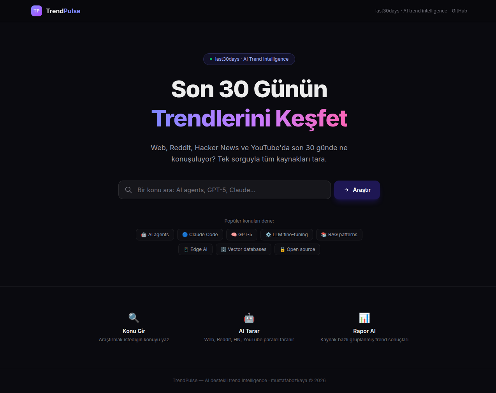
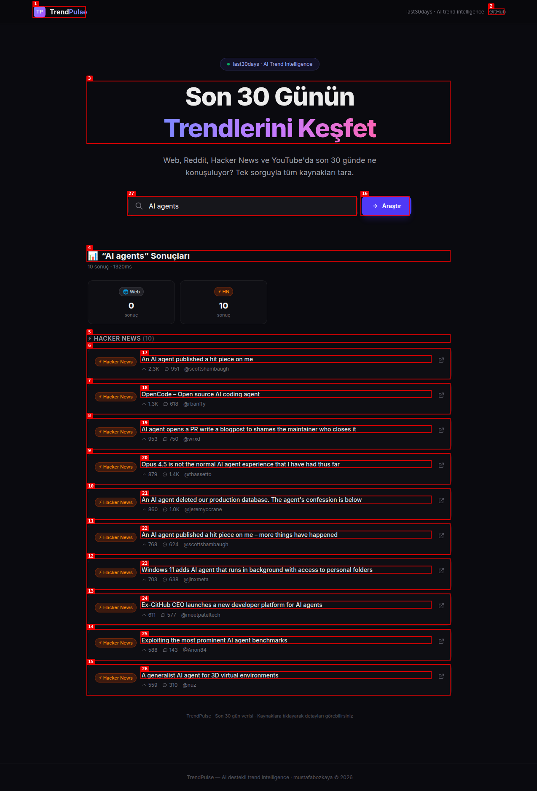

<div align="center">
  <h1 align="center">🚀 TrendPulse</h1>
  <p align="center"><strong>Son 30 Günün Trendlerini Keşfet — Web, Reddit, HN, YouTube</strong></p>

  <p align="center">
    <a href="https://trendpulse-green.vercel.app" target="_blank">
      
    </a>
    <a href="https://github.com/mustafabozkaya/trendpulse/blob/main/LICENSE">
      
    </a>
    <a href="https://github.com/mustafabozkaya/trendpulse/stargazers">
      
    </a>
  </p>

  <br />

  <!-- Demo GIF -->
  

  <br/><br/>

  <!-- Screenshots -->
  <table>
    <tr>
      <td align="center"><strong>🏠 Ana Sayfa</strong></td>
      <td align="center"><strong>📊 Arama Sonuçları</strong></td>
    </tr>
    <tr>
      <td></td>
      <td></td>
    </tr>
  </table>
</div>

---

## ✨ Özellikler

- **🌐 Çoklu Kaynak** — Web, Reddit, Hacker News, YouTube — tek sorguda
- **⚡ Hızlı** — ~1-2 saniyede sonuçlar
- **🔒 Sıfır API Key** — DuckDuckGo + Reddit JSON + HN Algolia + Invidious
- **📦 Sıfır Kurulum** — Browser'da aç, kullanmaya başla
- **🆓 Tamamen Ücretsiz** — Şimdilik
- **📱 Responsive** — Mobil, tablet, desktop
- **🔄 Cache + Rate Limit** — 5dk TTL, 10req/dk/IP
- **📜 Açık Kaynak (MIT)** — Fork'la, geliştir

## 🚀 Canlı Demo

👉 **https://trendpulse-green.vercel.app**

Hiçbir şey kurmadan hemen kullanmaya başla. Bir konu yaz, 1-2sn'de Web + Reddit + HN + YouTube sonuçları gelsin.

## 🛠️ Nasıl Çalışır?

```
Kullanıcı → Arama sorgusu → API Gateway
                              ├── Cache kontrolü (varsa direkt dön)
                              ├── Rate limit kontrolü
                              └── Paralel sorgular:
                                  ├── DuckDuckGo (Web)
                                  ├── Reddit JSON
                                  ├── HN Algolia
                                  └── Invidious (YouTube)
                              → JSON → React UI
```

## 📦 Teknoloji Stack

| Katman | Teknoloji |
|--------|-----------|
| **Framework** | Next.js 16 (App Router) |
| **UI** | Tailwind CSS v4 |
| **Deploy** | Vercel (Serverless Functions) |
| **Cache** | In-memory TTL cache (5dk, max 200 entry) |
| **Rate Limit** | IP-based (10 istek/dk) |
| **Arama** | DuckDuckGo, Reddit JSON, HN Algolia, Invidious |

## 🏗️ Proje Yapısı

```
trendpulse/
├── app/
│   ├── api/research/route.js   # API endpoint (cache + rate-limit + paralel)
│   ├── page.js                 # Ana sayfa
│   ├── layout.js               # SEO, OG, metadata
│   ├── not-found.js            # 404
│   └── robots.js               # SEO robots
├── components/
│   ├── search-bar.jsx
│   ├── source-card.jsx
│   ├── stats-bar.jsx
│   ├── results-dashboard.jsx
│   └── trending-topics.jsx
├── lib/
│   ├── cache.js                # In-memory cache
│   ├── rate-limit.js           # Rate limiter
│   ├── research.js             # Çoklu kaynak arama motoru
│   └── utils.js
├── public/
│   └── assets/                 # Screenshots + demo GIF
└── package.json
```

## ⚙️ Geliştirme

```bash
git clone https://github.com/mustafabozkaya/trendpulse.git
cd trendpulse
npm install
npm run dev       # http://localhost:3000
```

### Build

```bash
npm run build
npm start
```

## 🗺️ Roadmap

- [x] MVP — Web + Reddit + HN + YouTube
- [ ] 🐦 X/Twitter entegrasyonu
- [ ] 🔮 Polymarket (tahmin piyasaları)
- [ ] 📱 TikTok desteği
- [ ] 📄 PDF rapor export
- [ ] 🤖 AI sentez raporu
- [ ] 👤 Kullanıcı girişi + abonelik
- [ ] 🔗 API erişimi

## 🤝 Katkıda Bulunma

1. Fork'la
2. Branch aç: `git checkout -b yeni-ozellik`
3. Commit: `git commit -m 'Yeni özellik: ...'`
4. Push: `git push origin yeni-ozellik`
5. PR aç

Issue ve öneriler: [GitHub Issues](https://github.com/mustafabozkaya/trendpulse/issues)

## 📬 İletişim

- **LinkedIn:** [Mustafa Bozkaya](https://linkedin.com/in/mustafa-bozkaya)
- **GitHub:** [@mustafabozkaya](https://github.com/mustafabozkaya)
- **X:** [@ainsighthubs](https://x.com/ainsighthubs)
- **Portfolio:** [mustafabozkaya.github.io](https://mustafabozkaya.github.io)

## 📄 Lisans

MIT License — detaylar için [LICENSE](LICENSE)'e bak.

---

<div align="center">
  <sub>Built with ❤️ by <a href="https://github.com/mustafabozkaya">@mustafabozkaya</a></sub>
  <br/>
  <sub>🚀 <a href="https://trendpulse-green.vercel.app">trendpulse.vercel.app</a></sub>
</div>
